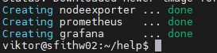
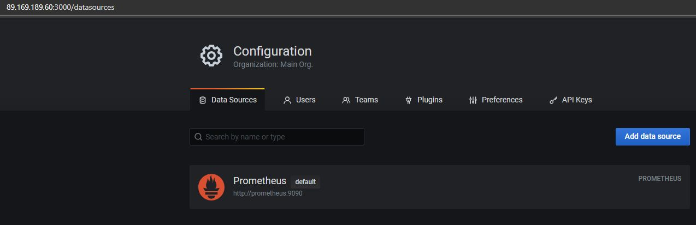
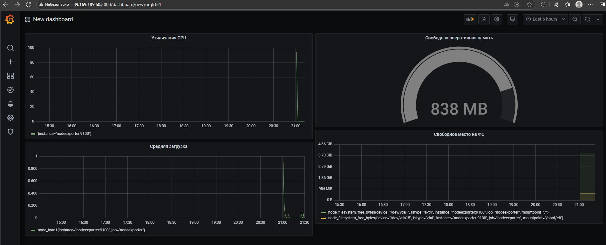

# Домашнее задание к занятию 14 «Средство визуализации Grafana»

## Обязательные задания

### Задание 1

1. Используя директорию [help](https://github.com/netology-code/mnt-homeworks/tree/MNT-video/10-monitoring-03-grafana/help) внутри этого домашнего задания, запустите связку prometheus-grafana.
1. Зайдите в веб-интерфейс grafana, используя авторизационные данные, указанные в манифесте docker-compose.
1. Подключите поднятый вами prometheus, как источник данных.
1. Решение домашнего задания — скриншот веб-интерфейса grafana со списком подключенных Datasource.

### Решение 1




------

## Задание 2

Изучите самостоятельно ресурсы:

1. [PromQL tutorial for beginners and humans](https://valyala.medium.com/promql-tutorial-for-beginners-9ab455142085).
1. [Understanding Machine CPU usage](https://www.robustperception.io/understanding-machine-cpu-usage).
1. [Introduction to PromQL, the Prometheus query language](https://grafana.com/blog/2020/02/04/introduction-to-promql-the-prometheus-query-language/).

Создайте Dashboard и в ней создайте Panels:

- утилизация CPU для nodeexporter (в процентах, 100-idle);
- CPULA 1/5/15;
- количество свободной оперативной памяти;
- количество места на файловой системе.

Для решения этого задания приведите promql-запросы для выдачи этих метрик, а также скриншот получившейся Dashboard.

### Решение 2

Мои запросы

Утилизация CPU (в процентах, 100-idle)

```
100 - (avg by(instance) (rate(node_cpu_seconds_total{mode="idle"}[2m])) * 100)
```

Средняя загрузка системы (Load Average) 1/5/15 минут

```
node_load1 or node_load5 or node_load15
```

Количество свободной оперативной памяти

```
node_memory_MemFree_bytes
```

Количество свободного места на файловой системе
```
node_filesystem_free_bytes{mountpoint="/"}
```



------

## Задание 3

1. Создайте для каждой Dashboard подходящее правило alert — можно обратиться к первой лекции в блоке «Мониторинг».
1. В качестве решения задания приведите скриншот вашей итоговой Dashboard.

### Решение 3

Были созданы алерты на каждый дашборд

### 1. Алерт: Утилизация CPU
**Метрика:** `100 - (avg by(instance) (rate(node_cpu_seconds_total{mode="idle"}[2m])) * 100)`
- **Порог:** > 90%
- **Время срабатывания:** 3 минуты
- **Severity:** Warning
- **Condition в Grafana:**
  ```
  WHEN: last()
  OF: query(A, 1m, now)
  IS ABOVE: 90
  ```
  
 
  

------

## Задание 4

1. Сохраните ваш Dashboard.Для этого перейдите в настройки Dashboard, выберите в боковом меню «JSON MODEL». Далее скопируйте отображаемое json-содержимое в отдельный файл и сохраните его.
1. В качестве решения задания приведите листинг этого файла.

### Решение 4

------

---

### Как оформить решение задания

Выполненное домашнее задание пришлите в виде ссылки на .md-файл в вашем репозитории.

---